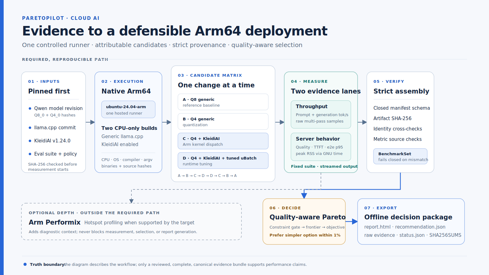

# ParetoPilot architecture

ParetoPilot is an evidence-to-deployment decision pipeline. It does not sit in the inference
request path. Instead, it runs controlled candidates on one native Arm64 runner, validates their
artifacts, applies declared quality and resource constraints, and exports a reproducible
deployment recommendation with an offline report.

Canonical v1.1 [run `30055662526`](../results/published/30055662526/README.md) completed the core
path and the additive behavior, policy, load, and repeat-stability lane. The earlier
[v1.0 result](../results/published/29973188507/README.md) remains preserved as a separate
historical experiment.

## End-to-end flow

1. **Pin the experiment.** The workflow fixes the model revisions and hashes, `llama.cpp` commit,
   KleidiAI release, evaluation suite, benchmark shape, load plan, policies, and decision
   constraints before measurement.
2. **Build on native Arm64.** One `ubuntu-24.04-arm` job builds CPU-only generic and
   KleidiAI-enabled `llama.cpp` binaries and records the runner, operating system, compiler,
   build options, executable hashes, and exact launch arguments.
3. **Run attributable candidates.** Four candidates separate the Q8 reference, Q4 quantization,
   Arm kernel dispatch, and one runtime micro-batch change. Throughput and server measurements use
   the balanced order `A-B-C-D-D-C-B-A` on the same hosted runner.
4. **Measure authoritative producers.** `llama-bench` produces prompt and generation throughput.
   `llama-server` records exact-match behavior, streamed TTFT, end-to-end latency for fixed
   64-token generations, and bounded multi-client results. GNU `time -v` records peak RSS.
5. **Assemble strictly.** `paretopilot assemble-experiment` verifies the closed manifest schema,
   SHA-256 digests, candidate identities, model and runtime pins, evaluation-suite identity,
   exact commands, balanced aggregate recomputation, and captured KleidiAI dispatch logs before
   producing a `BenchmarkSet`.
6. **Decide under declared constraints.** The recommendation engine rejects candidates that fail
   quality or resource gates, computes the Pareto frontier, and minimizes the declared objective.
   A predeclared 1% tolerance prevents a practically tiny latency difference from being treated
   as an optimization win.
7. **Build supplementary views.** The workflow evaluates five deployment policies, assembles the
   bounded load sweep, reconstructs both balanced passes from raw evidence, and summarizes
   observed repeat stability.
8. **Lock and replay.** A bundle-level `SHA256SUMS` covers 150 released payloads. Offline replay
   verifies safe paths and checksums, rebuilds the core and extension outputs, and compares both
   self-contained reports without rerunning inference.

## Candidate attribution

| Candidate | Deliberate change | Attribution stage |
| --- | --- | --- |
| `q8-generic` | Q8_0 model on the generic CPU build | Reference baseline |
| `q4-generic` | Q4_0 model on the generic CPU build | Quantization |
| `q4-kleidiai` | Same Q4_0 model with the KleidiAI build | Arm kernel |
| `q4-kleidiai-tuned` | Same KleidiAI candidate with micro-batch size 512 | Runtime tuning |

The workflow hashes and re-verifies runtime logs: generic candidates must not report the
`CPU_KLEIDIAI model buffer`, while both KleidiAI candidates must report it. This proves the
intended dispatch distinction without treating a build flag alone as runtime evidence.

## V1.1 evidence lane

### Behavior contract

The 24-case suite is copied into the experiment, identified in the closed manifest, and verified
by SHA-256. Assembly checks every case, accepted answer, match mode, generation length, and pooled
server result against that exact file. The canonical run measured 21/24 passing cases for Q8 and
20/24 for each Q4 candidate.

### Bounded concurrency

Each candidate runs the same declared 1/2/4-client load plan with eight measured requests per
level. Per-candidate artifacts retain raw request samples, SLO results, the request origin, and
both the exact load and canonical server commands. Only host and port binding differences are
allowed. All candidates completed every request in the canonical run; concurrency 1 was the
highest SLO-passing level for each.

### Pass reconstruction

`assemble-repeat-pass` follows the source references already bound in the canonical benchmark,
verifies raw throughput, settings, server-evaluation, and process-memory files, and recomputes one
supplementary `BenchmarkSet` per pass. It does not estimate pass values by splitting a pooled
aggregate.

The stability summary compares six metrics across the two reconstructed passes. Its direction and
relative-spread labels describe only the observed passes and do not claim statistical
significance.

### Policy sensitivity

One canonical and four non-canonical profiles are evaluated from the same validated benchmark
set. `canonical-latency` must reproduce the core recommendation. The derived profiles expose how
the measured decision changes under memory, TTFT, prompt-ingest, or decode objectives; they are
not additional benchmark runs.

### Canonical reports and Pages presentation

`report.html` presents the core decision and `report-v1.1.html` combines the decision with policy,
load, and stability evidence. Both are rendered from bound inputs. The canonical release replay
matched all nine core and report comparisons and returned no differences or warnings.

The public Pages homepage is a separate presentation view generated from those same verified
inputs. The deploy workflow first verifies the pinned v1.1.0 release, replays all nine authoritative
outputs, and checks the exact `report-v1.1.html` digest. Only then does it generate the showcase.
Pages preserves the byte-identical canonical report at `evidence/report-v1.1.html`, so visual
presentation changes cannot silently rewrite the evidence artifact. The presentation's persistent
light/dark preference changes semantic color tokens only; it never alters the bound evidence.

## Evidence and decision boundaries

- Every candidate comparison belongs to one ephemeral Arm64 job. Results from different processor
  identities or runner images are not pooled as one experiment.
- Missing, malformed, mismatched, non-finite, digest-invalid, or path-escaping source data fails
  assembly; the pipeline does not estimate absent measurements.
- Quality, latency, throughput, and peak RSS have separate authoritative producers. TTFT, for
  example, is not inferred from `llama-bench`.
- Load evidence must match its declared plan, request endpoint, candidate identity, and server
  commands. A successful HTTP response alone is not sufficient provenance.
- A run is canonical only when it uses the default branch, the declared ten repetitions, and
  every measurement, integrity, selection, and reporting gate passes. Changed inputs remain
  exploratory.
- Arm Performix is an optional follow-up for hotspot analysis. It never blocks measurement,
  selection, replay, or report generation.

## Implementation map

| Component | Responsibility |
| --- | --- |
| [`.github/workflows/candidate-study-arm64.yml`](../.github/workflows/candidate-study-arm64.yml) | Native Arm64 build, measurement, provenance capture, integrity checks, and artifact upload |
| [`evals/qwen-smoke-v1.json`](../evals/qwen-smoke-v1.json) | Historical v1.0 fixed quality inputs |
| [`evals/qwen-behavior-v2.json`](../evals/qwen-behavior-v2.json) | V1.1 checksummed 24-case behavior and latency contract |
| [`configs/load.arm64.json`](../configs/load.arm64.json) | Bounded load shape and SLO declaration |
| [`configs/policies.arm64.json`](../configs/policies.arm64.json) | Canonical and derived deployment-policy profiles |
| [`configs/constraints.candidate-study.json`](../configs/constraints.candidate-study.json) | Quality, latency, memory, frontier, and objective policy |
| [`src/paretopilot/llama_summary.py`](../src/paretopilot/llama_summary.py) | Validated multi-pass throughput aggregation |
| [`src/paretopilot/server_eval.py`](../src/paretopilot/server_eval.py) | Exact-match behavior and streamed latency evaluation |
| [`src/paretopilot/experiment.py`](../src/paretopilot/experiment.py) | Strict multi-candidate manifest and artifact assembly |
| [`src/paretopilot/analysis.py`](../src/paretopilot/analysis.py) | Constraint filtering, Pareto frontier, and deterministic selection |
| [`src/paretopilot/pass_eval.py`](../src/paretopilot/pass_eval.py) | Raw repeat-pass verification and reconstruction |
| [`src/paretopilot/load_eval.py`](../src/paretopilot/load_eval.py) | Bounded multi-client evaluation and command binding |
| [`src/paretopilot/profiles.py`](../src/paretopilot/profiles.py) | Precomputed canonical and derived policy decisions |
| [`src/paretopilot/stability.py`](../src/paretopilot/stability.py) | Pass direction and spread summary without significance claims |
| [`src/paretopilot/replay.py`](../src/paretopilot/replay.py) | Checksummed core and extension regeneration |
| [`src/paretopilot/report.py`](../src/paretopilot/report.py) | Deterministic core HTML decision report |
| [`src/paretopilot/report_v11.py`](../src/paretopilot/report_v11.py) | Deterministic additive evidence report |
| [`src/paretopilot/showcase.py`](../src/paretopilot/showcase.py) | Judge-facing presentation generated from verified v1.1 inputs without changing the canonical report |
| [`.github/workflows/pages.yml`](../.github/workflows/pages.yml) | Release verification, exact replay, canonical-report preservation, and showcase publication |

## Published identity

The current evidence was produced by commit
[`8a9ddce0afa2272c4a4097fe87ef6f06cb7689a9`](https://github.com/agrovr/ParetoPilot/commit/8a9ddce0afa2272c4a4097fe87ef6f06cb7689a9)
on Ubuntu 24.04 Arm64 with a 4-vCPU Arm Neoverse-N2 CPU. It pins:

- `llama.cpp` `67b9b0e7f6ce45d929a4411907d3c48ec719e81c`;
- KleidiAI `1.24.0`;
- Qwen2.5 1.5B Instruct revision `91cad51170dc346986eccefdc2dd33a9da36ead9`; and
- evaluation-suite SHA-256
  `e49c16fba32fd65c947264aef4141026ab68b1fd415ef09eeea6e8ade9a545c7`.

## Truthful interpretation

The diagram documents the executable candidate-study path; it is not benchmark evidence by
itself. Canonical run `30055662526` completed that path and was rebuilt from its pinned
release archive in a separate verification pass. The result applies to this runner, model,
workload, and bounded load plan. ParetoPilot does not claim general model quality, statistical
significance, energy savings, cost savings, or hardware-counter findings that were not measured.
