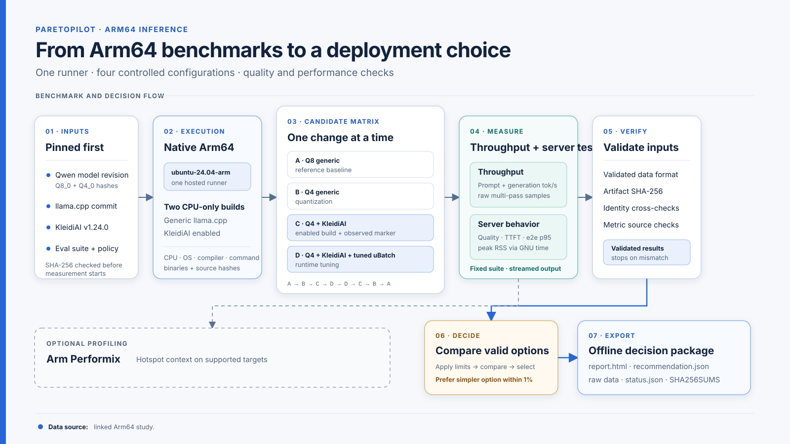

# ParetoPilot architecture

ParetoPilot compares controlled inference configurations on one native Arm64 runner. It validates
the results, applies declared quality and resource limits, and writes a reproducible recommendation
and offline report; it does not run in the live inference request path.

The current model result is v1.1
[run `30055662526`](../results/published/30055662526/README.md). The earlier
[v1.0 result](../results/published/29973188507/README.md) is kept as a separate experiment.

## End-to-end flow

1. **Pin the experiment.** The workflow fixes the model revisions and hashes, `llama.cpp` commit,
   KleidiAI release, evaluation suite, benchmark shape, load plan, policies, and decision
   constraints before measurement.
2. **Build on native Arm64.** One `ubuntu-24.04-arm` job builds CPU-only generic and
   KleidiAI-enabled `llama.cpp` binaries and records the runner, operating system, compiler,
   build options, executable hashes, and exact launch arguments.
3. **Run controlled configurations.** Four candidates separate the Q8 reference, Q4 quantization,
   a KleidiAI-enabled build with an observed model-buffer marker, and one runtime micro-batch
   change. Throughput and server measurements use the mirrored order `A-B-C-D-D-C-B-A` on the
   same hosted runner.
4. **Collect each metric from its source.** `llama-bench` produces prompt and generation throughput.
   `llama-server` records exact-match behavior, streamed TTFT, end-to-end latency for fixed
   64-token generations, and bounded multi-client results. GNU `time -v` records peak RSS.
5. **Validate and assemble results.** `paretopilot assemble-experiment` verifies the manifest,
   SHA-256 digests, candidate identities, model and runtime pins, evaluation-suite identity,
   exact commands, mirrored-pass aggregate recomputation, and captured model-buffer-marker logs
   before producing a `BenchmarkSet`.
6. **Decide under declared constraints.** The recommendation engine rejects candidates that fail
   quality or resource checks, computes the Pareto frontier, and minimizes the declared objective.
   A 1% tolerance defined before the run prevents a tiny latency difference from being treated
   as a meaningful improvement.
7. **Build additional views.** The workflow evaluates five deployment priorities, assembles the
   bounded load sweep, reconstructs both mirrored passes from raw data, and summarizes
   repeatability.
8. **Verify and replay.** A bundle-level `SHA256SUMS` covers 150 released payloads. Offline replay
   verifies safe paths and checksums, rebuilds the core and extension outputs, and compares both
   self-contained reports without rerunning inference.
9. **Check changes in CI.** The reusable GitHub Action validates a benchmark set and its
   constraints, rejects synthetic inputs by default, writes the recommendation and reports, and
   can fail CI when the selected candidate changes or required Arm64 source details are missing.

## Candidate changes

| Candidate | Deliberate change | Optimization step |
| --- | --- | --- |
| `q8-generic` | Q8_0 model on the generic CPU build | Reference baseline |
| `q4-generic` | Q4_0 model on the generic CPU build | Quantization |
| `q4-kleidiai` | Same Q4_0 model with the KleidiAI-enabled build | KleidiAI-enabled build |
| `q4-kleidiai-tuned` | Same KleidiAI candidate with micro-batch size 512 | Runtime tuning |

The workflow hashes and re-verifies runtime logs: generic candidates must not report the
`CPU_KLEIDIAI model buffer`, while both KleidiAI candidates must report it. This confirms that the
intended build logged the model-buffer marker; it does not prove that a particular microkernel
executed.

## V1.1 measurements and validation

### Behavior checks

The 24-case suite is copied into the experiment, identified in the manifest, and verified
by SHA-256. Assembly checks every case, accepted answer, match mode, generation length, and pooled
server result against that exact file. The published run measured 21/24 passing cases for Q8 and
20/24 for each Q4 candidate.

### Bounded concurrency

Each candidate runs the same declared 1/2/4-client load plan with eight measured requests per
level. Per-candidate artifacts retain raw request samples, SLO results, the request origin, and
both recorded server commands. Only host and port binding differences are allowed. All candidates
completed every request in the published run; concurrency 1 was the
highest SLO-passing level for each.

### Pass reconstruction

`assemble-repeat-pass` follows the source references already bound in the published benchmark,
verifies raw throughput, settings, server-evaluation, and process-memory files, and recomputes one
`BenchmarkSet` per pass. It does not estimate pass values by splitting a pooled aggregate.

The stability summary compares six metrics across the two reconstructed passes. Its direction and
relative-spread labels describe only the observed passes and do not claim statistical
significance.

## V1.4 capacity study

Capacity [run `30144901854`](../results/published/30144901854/README.md) uses the published Q8
latency choice and tuned-Q4 resource alternative to evaluate a 3×3 server-slot/client matrix.
It uses two mirrored forward/reverse passes, preserves every request sample and rejected gate, and
selects an operating point independently within each candidate. This study sizes each candidate;
it does not choose between Q8 and Q4.

The v1.4 release retains the original Actions ZIP. `replay-capacity` checks every file, rebuilds
the capacity study and Markdown summary from the raw measurements, and then replays the embedded
v1.1 archive.

`verify-published` checks both published releases. It verifies each URL, run ID, byte size, and
SHA-256, then rebuilds the archived decisions. The command can download the archives or use local
copies and writes JSON and Markdown summaries.

### Deployment priorities

Five priorities are calculated from the same validated benchmark set. `canonical-latency`
reproduces the published recommendation. The other four show how the result changes when memory,
TTFT, prompt processing, or generation throughput takes priority; they are not additional runs.

### Reports and public site

`report.html` presents the core decision and `report-v1.1.html` combines the decision with policy,
load, and stability results. Both are rendered from validated inputs. The release replay
matched all nine core and report comparisons and returned no differences or warnings.

The Pages workflow verifies the v1.1.0 release and rebuilds all nine archived outputs before it
generates the public homepage. The original report remains available at
`evidence/report-v1.1.html`.

## What the result covers

- Every comparison comes from the same temporary Arm64 job. Results from different processors or
  runner images are not combined into one experiment.
- Missing or invalid measurements are rejected rather than estimated. Each metric is read from
  its declared source; for example, TTFT is not inferred from `llama-bench`.
- Source files and generated outputs are checksummed. The published archives can be replayed
  without rerunning inference.
- The result applies only to the measured runner, model, commands, and workload. Metadata checks
  confirm that required fields are present; they do not independently authenticate them.
- Arm Performix is optional for follow-up profiling and is not required to measure, select,
  replay, or report a result.

## Implementation map

| Component | Responsibility |
| --- | --- |
| [`.github/workflows/candidate-study-arm64.yml`](../.github/workflows/candidate-study-arm64.yml) | Native Arm64 build, measurement, provenance capture, integrity checks, and artifact upload |
| [`evals/qwen-smoke-v1.json`](../evals/qwen-smoke-v1.json) | Historical v1.0 fixed quality inputs |
| [`evals/qwen-behavior-v2.json`](../evals/qwen-behavior-v2.json) | V1.1 checksummed 24-case behavior and latency contract |
| [`configs/load.arm64.json`](../configs/load.arm64.json) | Bounded load shape and SLO declaration |
| [`configs/policies.arm64.json`](../configs/policies.arm64.json) | Published and alternative deployment priorities |
| [`configs/constraints.candidate-study.json`](../configs/constraints.candidate-study.json) | Quality, latency, memory, frontier, and objective policy |
| [`src/paretopilot/llama_summary.py`](../src/paretopilot/llama_summary.py) | Validated multi-pass throughput aggregation |
| [`src/paretopilot/server_eval.py`](../src/paretopilot/server_eval.py) | Exact-match behavior and streamed latency evaluation |
| [`src/paretopilot/experiment.py`](../src/paretopilot/experiment.py) | Multi-candidate manifest validation and artifact assembly |
| [`src/paretopilot/analysis.py`](../src/paretopilot/analysis.py) | Constraint filtering, Pareto frontier, and deterministic selection |
| [`src/paretopilot/decision_passport.py`](../src/paretopilot/decision_passport.py) | Source metadata status, configuration comparisons, distance to the cutoff, and lower-resource alternative |
| [`src/paretopilot/optimization_receipt.py`](../src/paretopilot/optimization_receipt.py) | Markdown decision summary rendered from validated decision details |
| [`src/paretopilot/pass_eval.py`](../src/paretopilot/pass_eval.py) | Raw repeat-pass verification and reconstruction |
| [`src/paretopilot/load_eval.py`](../src/paretopilot/load_eval.py) | Bounded multi-client evaluation and command binding |
| [`src/paretopilot/profiles.py`](../src/paretopilot/profiles.py) | Policy decisions calculated from the same measurements |
| [`src/paretopilot/stability.py`](../src/paretopilot/stability.py) | Pass direction and spread summary without significance claims |
| [`src/paretopilot/replay.py`](../src/paretopilot/replay.py) | Checksummed core and extension regeneration |
| [`src/paretopilot/capacity_eval.py`](../src/paretopilot/capacity_eval.py) | Capacity-study validation, gate checks, and operating-point selection |
| [`src/paretopilot/capacity_receipt.py`](../src/paretopilot/capacity_receipt.py) | Human-readable capacity results and failed checks |
| [`src/paretopilot/capacity_replay.py`](../src/paretopilot/capacity_replay.py) | Capacity reconstruction plus embedded v1.1 replay |
| [`src/paretopilot/published_proof.py`](../src/paretopilot/published_proof.py) | Verification of both published evidence archives |
| [`src/paretopilot/report.py`](../src/paretopilot/report.py) | Deterministic core HTML decision report |
| [`src/paretopilot/report_v11.py`](../src/paretopilot/report_v11.py) | Reproducible v1.1 HTML report |
| [`src/paretopilot/showcase.py`](../src/paretopilot/showcase.py) | Public presentation generated from verified v1.1 inputs |
| [`action.yml`](../action.yml) | Reusable CI gate that validates evidence, enforces the expected selection, and emits hashed decision artifacts |
| [`.github/workflows/pages.yml`](../.github/workflows/pages.yml) | Release verification, replay, and public site deployment |

## Published identity

The published result was produced by commit
[`8a9ddce0afa2272c4a4097fe87ef6f06cb7689a9`](https://github.com/agrovr/ParetoPilot/commit/8a9ddce0afa2272c4a4097fe87ef6f06cb7689a9)
on Ubuntu 24.04 Arm64 with a 4-vCPU Arm Neoverse-N2 CPU. It pins:

- `llama.cpp` `67b9b0e7f6ce45d929a4411907d3c48ec719e81c`;
- KleidiAI `1.24.0`;
- Qwen2.5 1.5B Instruct revision `91cad51170dc346986eccefdc2dd33a9da36ead9`; and
- evaluation-suite SHA-256
  `e49c16fba32fd65c947264aef4141026ab68b1fd415ef09eeea6e8ade9a545c7`.
